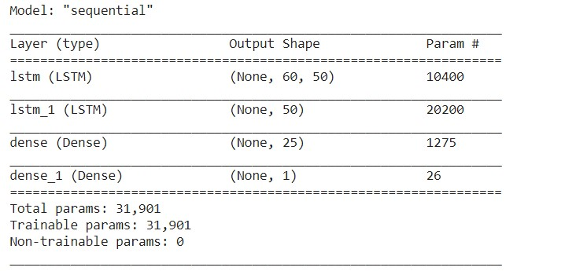
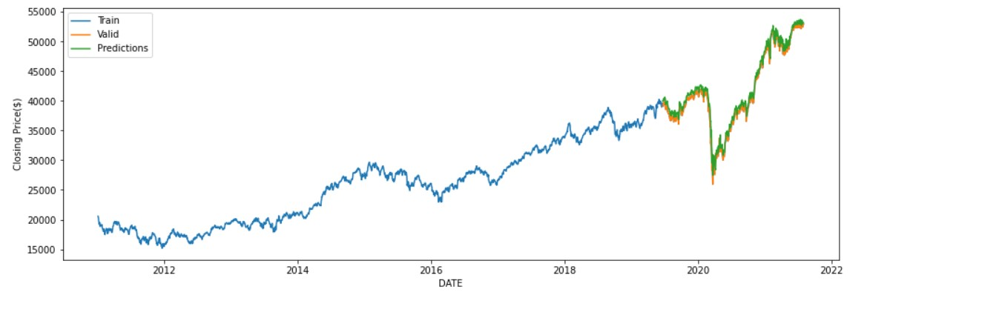
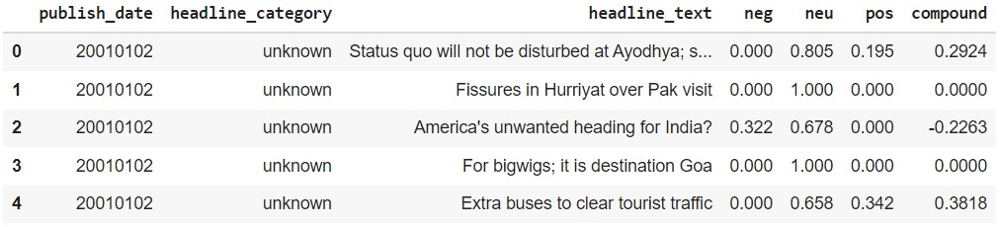

[](https://www.python.org/)

# Stock Prediction using LSTM and Sentiment Analysis 

## Overview
LSTM Model is created to predict the closing prices of `S&P BSE SENSEX`.
Sentiment Analysis is done on `Times of India News Headlines`

## Dataset
Historical data of S&P BSE SENSEX Stock is taken from `Yahoo Finance`. 
`india-news-headlines.csv` is used for Sentiment Analysis.

## LSTM Model
<p align="left">
 &ensp;&ensp;&ensp;&ensp;&ensp;&ensp;&ensp;&ensp;&ensp;
</p>

## Prerequisites
* Python 3 
* an IDE (preferably Google Colab)
* Pandas 
* Numpy 
* Matplotlib 
* Sklearn
* Keras
* Tensorflow
* NLTK


All the external dependencies can be installed by using ```pip install -r requirements.txt```

## Results

### Stock Prediction

<p align="left">
 &ensp;&ensp;&ensp;&ensp;&ensp;&ensp;&ensp;&ensp;&ensp;
</p>

### Sentiment Analysis

<p align="left">
 &ensp;&ensp;&ensp;&ensp;&ensp;&ensp;&ensp;&ensp;&ensp;
</p>

## Demo
Please refer to the colab notebook <a href = "https://colab.research.google.com/drive/1GJo049d4MmJv9IFe7WT2Fr3z56DfVOJj?usp=sharing">here</a> 

## Author
* Rishikesh Sivakumar

[](https://GitHub.com/Naereen/) by [Rishikesh Sivakumar](https://www.linkedin.com/in/rishikesh-sivakumar-1a166a18b/)

